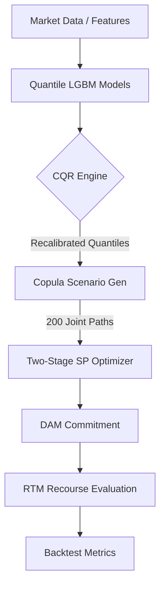

# System Architecture: Stochastic BESS Optimizer

This document details the mathematical framework, statistical methodologies, and design tradeoffs of the BESS Virtual Power Plant (VPP) optimization system.

---

## 1. Optimization Methodology: Two-Stage Stochastic Programming

The core decision engine is modeled as a **Two-Stage Stochastic Program (SP)** with recourse. This framework allows the optimizer to make robust commitments in the Day-Ahead Market (DAM) while anticipating the flexibility of the Real-Time Market (RTM).

### 1.1 Decision Variables
- **Stage 1 (DAM):** $x_{c,t}, x_{d,t} \in [0, P_{\max}]$ : Non-anticipative charge/discharge commitments. These must be identical across all scenarios $s$.
- **Stage 2 (RTM):** $y_{s,c,t}, y_{s,d,t} \in [0, P_{\max}]$ : Physical dispatch recourse actions taken after scenario $s$ is realized.
- **State:** $E_{s,t}$ : State of Charge (SoC) for scenario $s$ at time $t$.

### 1.2 Mathematical Objective
The model maximizes risk-adjusted expected net revenue:

$$\max \quad \mathbb{E}[R_s] + \lambda_{\text{risk}} \cdot \text{CVaR}_{\alpha}(R_s) - \text{Penalty}_{\text{stab}}$$

Where **Net Revenue ($R_s$)** per scenario is formulated as:
$$R_s = \sum_t \left[ p_{\text{dam},s,t} \cdot (x_{d,t} - x_{c,t}) + p_{\text{rtm},s,t} \cdot \Delta_{s,t} \right] - \text{Cost}_{\text{iex},s} - \text{Cost}_{\text{deg},s}$$

### 1.3 Linearization of Constraints
To maintain a Linear Program (LP) solvable by CBC/HiGHS, absolute values in transaction costs are linearized using auxiliary variables:
- **Deviation**: $\Delta_{s,t} = (y_{s,d,t} - y_{s,c,t}) - (x_{d,t} - x_{c,t})$
- **Market Churn**: $|\Delta_{s,t}| = \delta_{s,t}^+ + \delta_{s,t}^-$
- **Stability Penalty**: $\text{Penalty}_{\text{stab}} = \frac{\lambda_{\text{dev}}}{S} \sum_{s,t} (\delta_{s,t}^+ + \delta_{s,t}^-)$
  - This ensures that when DAM and RTM prices are equal, the system prefers the low-friction Stage 1 commitment.

---

## 2. Statistical Pipeline

### 2.1 Conformal Quantile Regression (CQR)
Predictive models (LightGBM) often exhibit "tails that are too thin." CQR recalibrates the quantile predictions using a validation residual $\delta_{\tau}$:
$$ q_{\tau, \text{calibrated}} = q_{\tau, \text{raw}} - \mathcal{Q}_{\tau}\{y_i - \hat{y}_i\} $$
Where residuals are defined as $e = y_{\text{actual}} - y_{\text{predicted}}$. This ensures the **empirical coverage** matches the nominal target $\tau$ exactly.

### 2.2 Joint Scenario Generation (Gaussian Copula)
To capture cross-market correlations ($\rho_{dam,rtm}$), we use a Gaussian Copula:
1. **Marginals**: Quantile LightGBM models predict the price distributions per hour.
2. **Correlation**: A covariance matrix is estimated between market residuals.
3. **Sampling**: 200 joint-correlated paths are sampled while preserving the temporal structure of the DAM.

---

## 3. Design Tradeoffs

| Choice | Alternative | Rationale |
| :--- | :--- | :--- |
| **Two-Stage SP** | Deterministic (q50) | Deterministic models "chase" high-probability spreads that may only be marginally profitable, ignoring the risk of deep-tail losses that SP captures via scenario fans. |
| **Gaussian Copula** | Independent Sampling | Markets are highly coupled ($\rho \approx 0.6$). Independent sampling would underestimate the probability of joint price spikes, leading to aggressive (and risky) commitments. |
| **CVaR Metric** | Standard Deviation | CVaR is coherent and focuses exclusively on downside tail risk, which is critical for merchant BESS assets with high Capex/Opex sensitivity. |

---

## 4. Key Constraints & Physicality

- **Terminal State Equality:** $E_{s,24} = E_{\text{initial}}$. We enforce a fixed terminal SoC (typically 50%) to prevent "value-leakage" where the optimizer drains the battery to maximize Day 1 revenue at the expense of Day 2 readiness.
- **Efficiency Losses:** Round-trip efficiency is modeled as $\eta_{\text{rt}} = 90\%$, applied as $\eta = 94.87\%$ for both charging and discharging steps.
- **Physical Friction:** A degradation cost of ₹650/MWh is applied to all discharge units, ensuring the battery only cycles when market spreads exceed the cost of wear-and-tear.

---

## 5. System Data Flow

