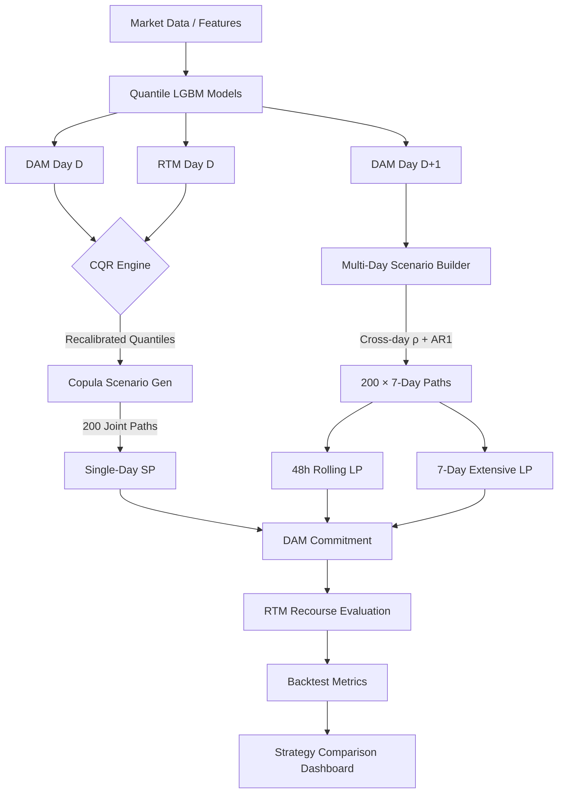

# System Architecture: Stochastic BESS Optimizer

This document details the mathematical framework, statistical methodologies, and design tradeoffs of the BESS Virtual Power Plant (VPP) optimization system.

---

## 1. Optimization Methodology

The system supports three optimizer formulations, all based on **Stochastic Programming (SP) with recourse**.

### 1.1 Single-Day Two-Stage SP (`two_stage_bess.py`)

The core decision engine is modeled as a **Two-Stage Stochastic Program** with recourse.

**Decision Variables:**
- **Stage 1 (DAM):** $x_{c,t}, x_{d,t} \in [0, P_{\max}]$ : Non-anticipative charge/discharge commitments. These must be identical across all scenarios $s$.
- **Stage 2 (RTM):** $y_{s,c,t}, y_{s,d,t} \in [0, P_{\max}]$ : Physical dispatch recourse actions taken after scenario $s$ is realized.
- **State:** $E_{s,t}$ : State of Charge (SoC) for scenario $s$ at time $t$.

**Objective:**
$$\max \quad \mathbb{E}[R_s] + \lambda_{\text{risk}} \cdot \text{CVaR}_{\alpha}(R_s) - \text{Penalty}_{\text{stab}}$$

Where **Net Revenue ($R_s$)** per scenario is:
$$R_s = \sum_t \left[ p_{\text{dam},s,t} \cdot (x_{d,t} - x_{c,t}) + p_{\text{rtm},s,t} \cdot \Delta_{s,t} \right] - \text{Cost}_{\text{iex},s} - \text{Cost}_{\text{deg},s}$$

### 1.2 48-Hour Rolling Horizon (`rolling_horizon_bess.py`)

Extends the single-day SP to a **48-hour window** (Day D + Day D+1):
- Optimizes across both days jointly, capturing overnight spread opportunities.
- Only the Day D DAM schedule is committed; Day D+1 is re-solved on the next day.
- Uses D+1 price forecasts for the second day's scenarios.

### 1.3 7-Day Extensive Form (`multiday_bess.py`)

Full **multi-day LP** with 7-day lookahead:
- Models 7 days × 24 hours per scenario, enabling week-long dispatch strategies.
- Terminal SoC on Day 7 is unconstrained (value is captured through the planning horizon).
- Computationally heavier but can exploit multi-day price patterns.

### 1.4 Linearization
To maintain LP solvability (CBC/HiGHS), absolute values are linearized:
- **Deviation**: $\Delta_{s,t} = (y_{s,d,t} - y_{s,c,t}) - (x_{d,t} - x_{c,t})$
- **Market Churn**: $|\Delta_{s,t}| = \delta_{s,t}^+ + \delta_{s,t}^-$
- **Stability Penalty**: $\text{Penalty}_{\text{stab}} = \frac{\lambda_{\text{dev}}}{S} \sum_{s,t} (\delta_{s,t}^+ + \delta_{s,t}^-)$

---

## 2. Terminal SoC Constraint Modes

The terminal SoC constraint is a critical design parameter:

| Mode | Constraint | Effect |
| :--- | :--- | :--- |
| **Hard** | $E_{s,24} \geq E_{\text{terminal\_min}}$ (100 MWh) | Forces daily reset. Conservative. |
| **Soft** | $E_{s,24} \geq E_{\min}$ (20 MWh) + continuation value term | Allows overnight carry. **Production default.** |
| **Physical** | $E_{s,24} \geq E_{\min}$ (20 MWh) only | Used in Option B evaluation. |

**Production strategy (₹204.4M)**: Soft terminal with SoC chaining — the optimizer plans with a continuation value incentive to retain energy, and the overnight SoC is carried forward to the next day's initial SoC.

---

## 3. Evaluation: Option A vs Option B

During backtesting, the **planning LP** and the **evaluation LP** can use different terminal constraints:

- **Option A**: Evaluation LP uses hard terminal ($E_{24} \geq 100$ MWh). Conservative — guaranteed energy for next day, but sacrifices intraday spread.
- **Option B**: Evaluation LP uses physical floor ($E_{24} \geq 20$ MWh). Aggressive — captures full daily spread, but SoC may not recover.

The `force_terminal_mode` parameter in `evaluate_actuals()` controls this, driven by config key `eval_terminal_mode`.

---

## 4. Statistical Pipeline

### 4.1 Probabilistic Forecasting

Three model families are trained:
- **DAM Day D**: 5-quantile LightGBM (q10, q25, q50, q75, q90). WMAPE: 15.7%.
- **RTM Day D**: Same architecture. WMAPE: 11.3%.
- **DAM Day D+1**: Reuses DAM hyperparameters, shifted features. WMAPE: 19.3%.

All models use the **D-1 08:00 IST snapshot** — no future data leakage.

### 4.2 Conformal Quantile Regression (CQR)

CQR recalibrates quantile predictions using validation residuals:
$$ q_{\tau, \text{calibrated}} = q_{\tau, \text{raw}} - \mathcal{Q}_{\tau}\{y_i - \hat{y}_i\} $$
This ensures **empirical coverage matches nominal target** $\tau$ exactly.

### 4.3 Joint Scenario Generation (Gaussian Copula)

#### Single-Day Scenarios
1. **Marginals**: Quantile models → PIT → uniform → Gaussian z-scores.
2. **Cross-market correlation**: Hour-wise DAM↔RTM $\rho(h)$ estimated from validation residuals.
3. **Within-market correlation**: DAM 24×24 covariance matrix Σ via Cholesky decomposition.
4. **Sampling**: 200 joint-correlated (DAM, RTM) paths per day.

#### Multi-Day Scenarios (`build_multiday_scenarios.py`)
Extends single-day with **cross-day temporal correlation**:
1. **Cross-day ρ**: Estimated via lag-1 autocorrelation of daily-average z-scores (ρ = 0.241).
2. **AR(1) process**: Day-to-day mean z-score follows $\bar{z}_{d+1} = \rho \cdot \bar{z}_d + \sqrt{1-\rho^2} \cdot \epsilon$.
3. **Within-day structure**: Cholesky decomposition of DAM Σ applied to each day's residuals.
4. **Quantile sources by day offset**:
   - Day D: trained DAM model predictions
   - Day D+1: D+1 DAM forecaster predictions
   - Days D+2..D+6: climatological fallback (expanding-window median)

**Output**: 200 scenarios × 7 days × 24 hours × 2 markets = 200,200 rows per market.

---

## 5. Design Tradeoffs

| Choice | Alternative | Rationale |
| :--- | :--- | :--- |
| **Two-Stage SP** | Deterministic (q50) | Deterministic models chase high-probability spreads, ignoring tail-risk. SP captures the full distribution. |
| **Gaussian Copula** | Independent Sampling | Markets are coupled ($\rho \approx 0.6$). Independent sampling underestimates joint spike probability. |
| **CVaR Metric** | Standard Deviation | CVaR is coherent and focuses on downside tail risk — critical for merchant BESS with high Capex sensitivity. |
| **Soft Terminal** | Hard Terminal | Hard terminal sacrifices ₹6.3M (3.2%) by forcing daily SoC reset. Soft terminal + SoC chaining captures overnight carry value. |
| **AR(1) Cross-Day** | IID Days | Price levels are autocorrelated ($\rho=0.24$). IID sampling would produce unrealistic multi-day paths with excessive mean-reversion. |

---

## 6. Key Constraints & Physicality

- **Terminal State**: Configurable — hard ($E_{24} \geq 100$ MWh), soft (continuation value + physical floor), or physical ($E_{24} \geq 20$ MWh). Production uses soft.
- **Efficiency Losses**: Round-trip efficiency $\eta_{\text{rt}} = 90\%$, applied as $\eta = 94.87\%$ per leg.
- **Physical Friction**: Degradation cost ₹650/MWh on all discharge. DSM friction proxy ₹135/MWh throughput.
- **SoC Drift Monitor**: Runtime warning if terminal SoC < 50 MWh for 3+ consecutive days (potential energy death spiral).

---

## 7. System Data Flow

