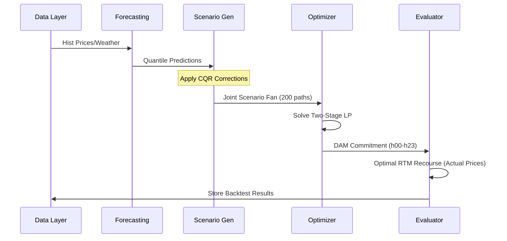

# Architecture & Technical Design: BESS Stochastic Optimizer

This document provides a deep dive into the mathematical framework, statistical models, and software architecture of the GENCO BESS Virtual Power Plant (VPP) system.

---

## 1. Stochastic Optimization Framework

The core of the system is a **Two-Stage Stochastic Linear Program (SLP)**. This approach explicitly models the decision-making process under uncertainty by splitting variables into those that must be decided "now" (Stage 1) and those that can wait until uncertainty is resolved (Stage 2).

### 1.1 Decision Variables
- **Stage 1 (Day-Ahead Market):** 
    - $x_{c,t}, x_{d,t} \in [0, P_{\max}]$ : Charging and discharging power committed to the DAM for hour $t$. 
    - These variables are **non-anticipative**, meaning they are identical across all scenarios $s$.
- **Stage 2 (Real-Time Market):**
    - $y_{s,c,t}, y_{s,d,t} \in [0, P_{\max}]$ : Actual physical dispatch in scenario $s$ at hour $t$.
    - These represent the "recourse" actions taken after RTM prices are observed.
- **State Variables:**
    - $E_{s,t}$ : Energy Level (SoC) of the battery in scenario $s$ at the end of hour $t$.

### 1.2 Mathematical Objective
The objective function maximizes the risk-adjusted expected net revenue:

$$\max \quad \frac{1}{S} \sum_{s=1}^S \text{NetRev}_s + \lambda \times \left( \zeta - \frac{1}{S \alpha} \sum_{s=1}^S u_s \right) - \text{StabilityPenalty}$$

**Revenue Components per Scenario ($s$):**
- **Market Revenue:** $\sum_t [ p_{\text{dam},s,t} \cdot (x_{d,t} - x_{c,t}) + p_{\text{rtm},s,t} \cdot ((y_{s,d,t} - y_{s,c,t}) - (x_{d,t} - x_{c,t})) ]$
- **Transaction Costs:** $C_{\text{iex}} \cdot \sum_t [ (x_{d,t} + x_{c,t}) + \text{abs}((y_{s,d,t} - y_{s,c,t}) - (x_{d,t} - x_{c,t})) ]$
- **Degradation:** $C_{\text{deg}} \cdot \sum_t y_{s,d,t}$

---

## 2. Statistical Pipeline

The quality of the optimization depends entirely on the **Scenario Fan**. We use a multi-layered approach to generate realistic joint price paths.

### 2.1 Conformal Quantile Regression (CQR)
Predictive models (LGBM) often suffer from "calibration drift." CQR fixes this by applying a scalar correction $\delta_{\tau}$ to raw quantile predictions:
$$ q_{\tau, \text{corrected}} = q_{\tau, \text{raw}} - \text{Quantile}_{\tau}(\text{Residuals}_{\text{val}}) $$
This ensures that the **conditional coverage** matches the nominal target exactly on the validation set.

### 2.2 Joint Copula Coupling
To capture the correlation between DAM and RTM prices, we use a **Gaussian Copula**:
1.  **Uniform Mapping**: Convert price scenarios to uniform space $U \in [0, 1]^{24}$ using the Inverse CDF (PIT).
2.  **Latent Correlation**: Map uniforms to standard normal space $Z = \Phi^{-1}(U)$.
3.  **DAM Temporal Structure**: $Z_{\text{dam}} = L \cdot \epsilon$, where $L$ is the Cholesky factor of the DAM hourly correlation matrix.
4.  **Cross-Market Dependency**: $Z_{\text{rtm},h} = \rho_h Z_{\text{dam},h} + \sqrt{1-\rho_h^2} \epsilon_h$.

---

## 3. Module Architecture

The codebase is structured into self-contained modules:

| Module | Responsibility | Key Classes/Functions |
| :--- | :--- | :--- |
| `src.features` | IEX feature engineering, lags, and rolling stats. | `FeatureEngineer` |
| `src.forecasting` | Quantile regression models and CQR engine. | `QuantileLGBM`, `compute_cqr_corrections` |
| `src.scenarios` | Copula fitting and scenario fan generation. | `DAMCopulaGenerator`, `RTMRolloutGenerator` |
| `src.optimizer` | LP formulation, CVaR logic, and solver interface. | `TwoStageBESS`, `BESSParams` |

### 3.1 Data Flow Sequence

---

## 4. Key Constraints & Heuristics

- **Terminal SoC Constraint:** $E_{24} \ge 100 \text{ MWh}$. Ensures multi-day sustainability; prevents the optimizer from "emptying the tank" at the end of a high-priced Day 1.
- **Physical Feasibility:** Simultaneous charging and discharging is naturally avoided by the objective function (due to the ₹200/side IEX fee friction), but strictly prevented by the SoC dynamics.
- **Asset Capacity:** 50MW Power / 200MWh Energy. SoC operating range: 20–180 MWh (160 MWh usable).
- **Efficiency**: 90% Round-trip ($\eta = 94.87\%$ for both charge and discharge).
- **Complexity**: Objective includes ₹650/MWh degradation and ₹50/MWh VOM per discharge unit.
