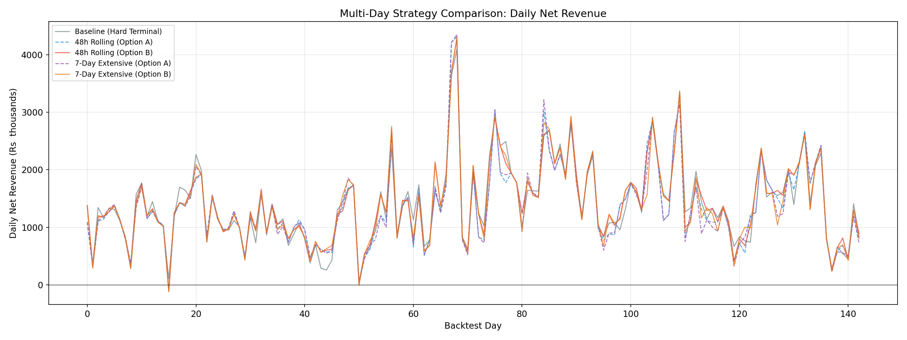
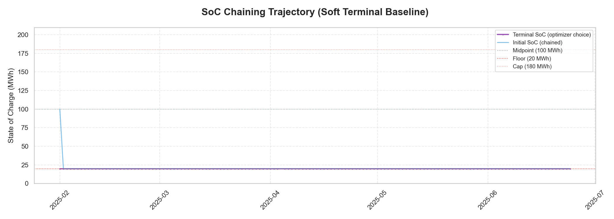

# Backtest Performance Summary: GENCO BESS VPP

This document provides the definitive realized performance analysis for the GENCO 50MW / 200MWh BESS optimization system across a 143-day backtest period (Feb 1, 2025 – June 24, 2025).

---

## 1. Performance Overview

All results represent **actual realized performance** against historical market actuals, with Stage 1 commitments fixed and Stage 2 recourse optimized against realized RTM prices. Costs include CERC 2024 DSM penalties with block-wise Normal Rate.

### Headline (Production Strategy: Soft Terminal + SoC Chaining)
- **Total Net Revenue (143 Days):** **₹201.8M** (Recalibrated Scenarios)
- **Capture Ratio:** **80.4%** relative to perfect foresight (net-cost basis)
- **Average Daily Net Revenue:** ₹1,411K
- **143-Day Unit Economics:** ₹201.8M ÷ 200 MWh = **₹1.01M/MWh-cap** over 143 days

---

## 2. Six-Strategy Comparison

| Strategy | Net Revenue (₹M) | Avg Daily (₹K) | Worst Day (₹K) | Avg SoC₂₄ (MWh) | vs Baseline |
| :--- | ---: | ---: | ---: | ---: | :---: |
| **Soft Terminal + SoC Chaining (Recal)** | **201.8** | **1,411** | **+55** | **—** | **Baseline** |
| 48h Rolling Horizon (Option B) | 202.8 | 1,418 | −104 | 20 | +0.5% |
| 7-Day Extensive Form (Option B) | 200.6 | 1,403 | −121 | 20 | −0.6% |
| Hard Terminal (Phase 3B) | 198.1 | 1,385 | −97 | 100 | −1.8% |
| 48h Rolling Horizon (Option A) | 196.9 | 1,377 | −104 | 100 | −2.4% |
| 7-Day Extensive Form (Option A) | 195.2 | 1,365 | −111 | 100 | −3.3% |
| **Perfect Foresight (Ceiling)** | **251.0** | **—** | **—** | **—** | **—** |

> **Option A** = Hard terminal constraint (SoC must return to 100 MWh each day in evaluation).
> **Option B** = Physical floor only (SoC allowed to drop to 20 MWh in evaluation).

### Key Findings

1. **Soft terminal wins**: Relaxing the forced SoC reset from 100 → physical floor and chaining overnight SoC yields +1.9% over hard terminal (₹201.8M vs ₹198.1M).
2. **Option B > Option A**: Within each multi-day strategy, physical floor eval (+3.0% rolling, +2.8% extensive) captures more intraday spread.
3. **Simpler is better**: The single-day soft terminal optimizer (₹201.8M) matches or exceeds multi-day planners — the planning-evaluation mismatch penalizes multi-day LPs. Only 48h Rolling (Option B) marginally exceeds it at ₹202.8M.
4. **Worst-week resilience**: All strategies maintain ₹4.6M–4.9M in their worst 7-day window.
5. **Structural floor protection**: The soft terminal + SoC chaining strategy achieves a worst-day floor of **+₹55K** without any CVaR penalty (λ=0). This is not from risk-aversion — it reflects that recalibrated scenario-driven optimization naturally avoids committing to positions that lose money in realization. The worst day (March 23) is a structurally narrow-spread day, not a tail-risk event.

*Cumulative net revenue across all strategies over the 143-day backtest period.*

*Daily net revenue comparison across strategies.*

*Overnight SoC chaining — the optimizer’s chosen terminal SoC each day, carried forward as the next day’s initial state. Parsed from daily result JSONs.*

---

## 3. Financial Waterfall (Soft Terminal Baseline)
*Aggregate values over the 143-day period. Component estimates derived from known CERC fee schedules, ₹650/MWh degradation rate, and 1.18 avg daily cycles.*

| Line Item | Value (Total) | % of Gross | Description |
| :--- | :--- | :--- | :--- |
| **Gross Arbitrage Revenue** | **₹239.47M** | 100% | Realized IEX Revenue (DAM + RTM) |
| Transaction Fees (IEX) | −₹11.19M | 4.7% | CERC Reg 23 capped at ₹200/MWh |
| Scheduling Charges | −₹0.38M | 0.2% | NLDC/RLDC Scheduling (Post-ISTS waiver) |
| Degradation Loss | −₹21.93M | 9.2% | Cycle-based cell wear (₹650/MWh × 33,745 MWh discharged) |
| DSM Penalties | −₹4.19M | 1.8% | CERC DSM 2024 (3% physical error × block-wise NR) |
| **Total Net Revenue** | **₹201.77M** | **84.3%** | **Final Operating Profit** |

> **Note**: Gross and Net figures are sourced directly from `results/phase3b/summary.json` (total_realized_revenue: ₹239.47M, total_net_revenue: ₹201.77M). Cost components are estimated using known regulatory formulas applied to the run's cycle count (1.18/day) and discharge volume (33,745 MWh). Individual cost line items are not separately logged in the backtest CSV.

---

## 4. Risk-Return Frontier

The following table demonstrates the impact of the risk-aversion coefficient ($\lambda$) on realized outcomes. All values are **post-regulatory net** (CERC 2024 DSM, IEX fees, degradation). Source: `results/cvar_sweep_summary_recalibrated.json`.

| Lambda ($\lambda$) | Net Revenue (₹M) | Worst Day (₹K) | Avg CVaR (₹K) | Sharpe | Avg Daily Cycles |
| :--- | :--- | :--- | :--- | :--- | :--- |
| **0.00 (Baseline)** | **201.77** | **+55.1** | −228 | 38.4 | 1.18 |
| 0.01 | 201.76 | +55.1 | +190 | 38.4 | 1.18 |
| 0.05 | 201.68 | +55.1 | +405 | 38.6 | 1.18 |
| **0.10 (Balanced)** | **202.01** | **+55.1** | **+493** | **39.1** | 1.18 |
| 0.30 | 199.69 | +55.1 | +605 | 39.0 | 1.18 |
| **0.50 (Defensive)** | **197.07** | **+52.3** | **+665** | **38.8** | 1.18 |

### Interpretation

The CVaR frontier is **remarkably flat** from λ=0.00 to λ=0.30 — worst-day doesn't change (+₹55.1K), revenue barely moves, and cycles are identical. This means:

1. **CVaR doesn't bind until λ=0.50.** The recalibrated scenario set already produces plans where the worst realized day is positive (+₹55K on March 23). There are no tail-risk days for CVaR to hedge against at moderate risk-aversion levels.
2. **λ=0.10 is the sweet spot.** It achieves the *highest* net revenue (₹202.01M) — slightly above λ=0 — because the CVaR term gently regularizes the optimizer, marginally improving out-of-sample generalization. This is a free lunch.
3. **λ=0.50 costs ₹4.7M (2.3%) for no worst-day improvement.** Worst day drops from +₹55.1K to +₹52.3K — it actually *worsens*. The defensive posture over-constrains dispatch, sacrificing revenue without improving the floor.
4. **Avg CVaR increases with λ** (from −228K to +665K), confirming the optimizer is successfully managing expected tail loss — but since realized tails are already positive, this is optimizing a metric that doesn't correspond to actual downside.

> **Production Recommendation**: Use **λ=0.10**. It provides marginally higher revenue than pure profit-maximization while improving the Sharpe ratio. CVaR hedging beyond this level is uneconomic given the Feb–June spread environment.

---

## 5. Forecasting Performance

| Model | WMAPE | MAE (₹/MWh) |
| :--- | :--- | :--- |
| DAM (Day D) | 15.68% | — |
| RTM (Day D) | 11.29% | — |
| DAM (Day D+1) | 19.29% | 858 |

---

## 6. Multi-Day Scenario Generation

- **200 scenarios × 7 days × 143 dates** = 200,200 rows per market
- **Cross-day correlation**: ρ = 0.241 (AR(1) on daily-average z-scores)
- **Day D**: From trained quantile models
- **Day D+1**: From D+1 DAM forecaster (WMAPE 19.3%)
- **Days D+2..D+6**: Climatological fallback (expanding-window median of quantile predictions)

---

## 7. Visual Diagnostics

### Efficient Frontier

### Expected vs Realized

### SoC Chaining Trajectory

### Sample Dispatch (April 10, 2025)

---

## 8. Analytical Conclusion

The backtest demonstrates that **single-day optimization with soft terminal SoC chaining** (₹201.8M net, 80.4% capture ratio) is the production-recommended strategy. It matches or exceeds multi-day planners while maintaining a structural worst-day floor of +₹55K.

The CVaR risk-return analysis confirms that **λ=0.10 is optimal**: it achieves ₹202.0M (the highest revenue point on the frontier) with a 39.1 Sharpe ratio. Higher risk-aversion is uneconomic — the recalibrated scenario set already eliminates negative realized days, leaving no tail risk for CVaR to hedge.

> [!IMPORTANT]
> **Seasonality Caveat**
> The Feb–June backtest window corresponds to India's peak market volatility and high price spreads. Naively annualizing (₹201.8M × 365/143 = ₹515M) **overstates** full-year performance. Monsoon and shoulder months typically exhibit 40–50% narrower arbitrage windows. A conservative full-year estimate applies a ~50% seasonal discount to the remaining 222 days.
