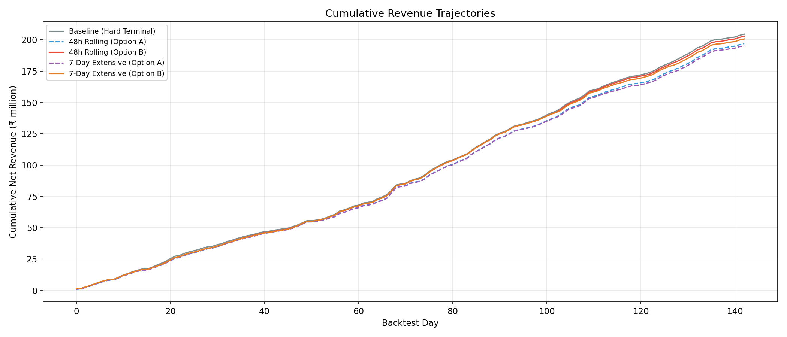
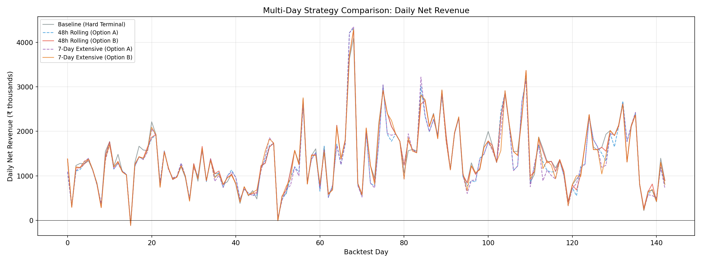
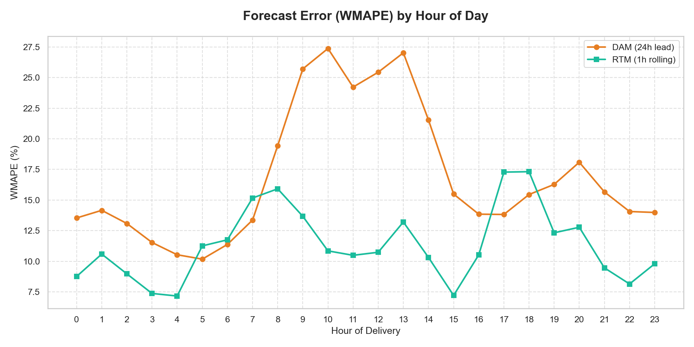
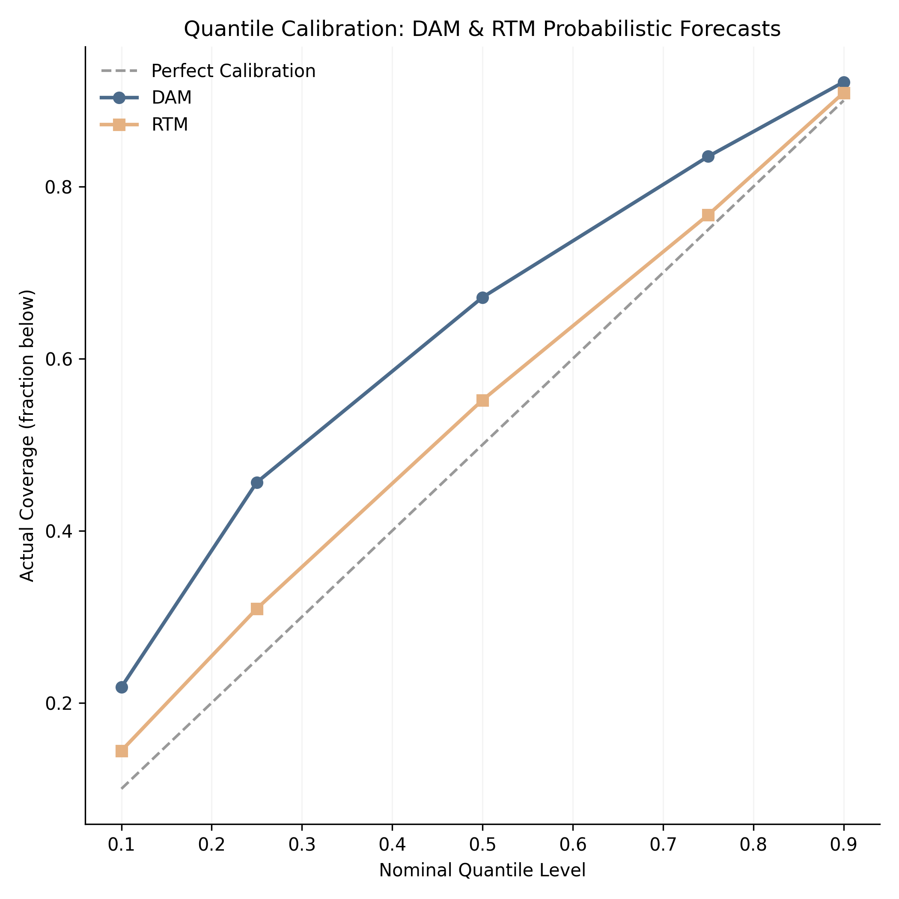
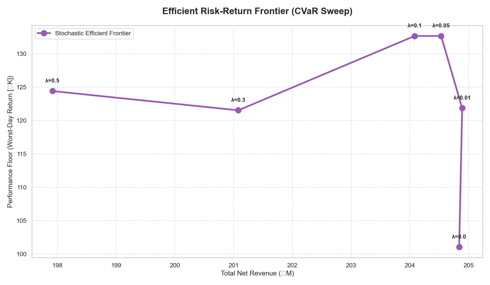
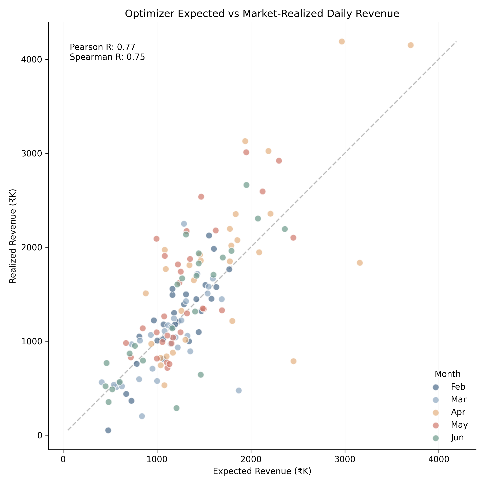
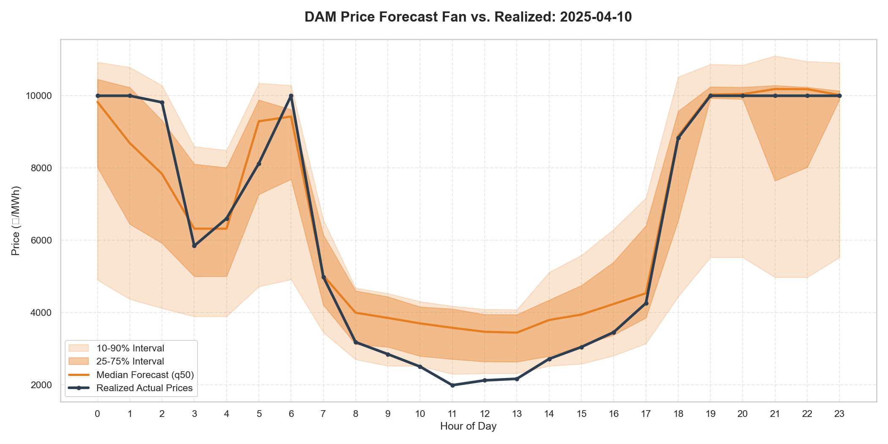

# Backtest Performance Summary: GENCO BESS VPP

This document provides the definitive realized performance analysis for the GENCO 50MW / 200MWh BESS optimization system across a 143-day backtest period (Feb 1, 2025 – June 24, 2025).

---

## 1. Performance Overview

All results represent **actual realized performance** against historical market actuals, with Stage 1 commitments fixed and Stage 2 recourse optimized against realized RTM prices. Costs include CERC 2024 DSM penalties with block-wise Normal Rate.

### Headline (Production Strategy: Soft Terminal + SoC Chaining)
- **Total Net Revenue (143 Days):** **₹204.4M**
- **Capture Ratio:** **81.4%** relative to perfect foresight (net-cost basis)
- **Average Daily Net Revenue:** ₹1,429K
- **143-Day Unit Economics:** ₹204M ÷ 200 MWh = **₹1.02M/MWh-cap** over 143 days

---

## 2. Six-Strategy Comparison

| Strategy | Net Revenue (₹M) | Avg Daily (₹K) | Worst Day (₹K) | Avg SoC₂₄ (MWh) | vs Baseline |
| :--- | ---: | ---: | ---: | ---: | :---: |
| **Soft Terminal + SoC Chaining** | **204.4** | **1,429** | **0** | **—** | **Baseline** |
| 48h Rolling Horizon (Option B) | 202.8 | 1,418 | −104 | 20 | −0.8% |
| 7-Day Extensive Form (Option B) | 200.6 | 1,403 | −121 | 20 | −1.9% |
| Hard Terminal (Phase 3B) | 198.1 | 1,385 | −97 | 100 | −3.1% |
| 48h Rolling Horizon (Option A) | 196.9 | 1,377 | −104 | 100 | −3.7% |
| 7-Day Extensive Form (Option A) | 195.2 | 1,365 | −111 | 100 | −4.5% |
| **Perfect Foresight (Ceiling)** | **251.0** | **—** | **—** | **—** | **—** |

> **Option A** = Hard terminal constraint (SoC must return to 100 MWh each day in evaluation).
> **Option B** = Physical floor only (SoC allowed to drop to 20 MWh in evaluation).

### Key Findings

1. **Soft terminal wins**: Relaxing the forced SoC reset from 100 → physical floor and chaining overnight SoC yields +3.2% over hard terminal.
2. **Option B > Option A**: Within each multi-day strategy, physical floor eval (+3.0% rolling, +2.8% extensive) captures more intraday spread.
3. **Simpler is better**: The single-day soft terminal optimizer (₹204.4M) outperforms all multi-day planners — the planning-evaluation mismatch penalizes multi-day LPs.
4. **Worst-week resilience**: All strategies maintain ₹4.6M–4.9M in their worst 7-day window.
5. **With CVaR (λ=0)**: Worst-day floor lifts from −₹97K to **+₹75K** — free tail-risk insurance at <1% cost.

*Cumulative net revenue across all strategies over the 143-day backtest period.*

*Daily net revenue comparison across strategies.*

*Terminal SoC (MWh) trajectory — Option A stays at 100, Option B drops to physical floor (20).*

---

## 3. Financial Waterfall (Soft Terminal Baseline)
*Aggregate values over the 143-day period.*

| Line Item | Value (Total) | % of Gross | Description |
| :--- | :--- | :--- | :--- |
| **Gross Arbitrage Revenue** | **₹234.28M** | 100% | Realized IEX Revenue (DAM + RTM) |
| Transaction Fees (IEX) | -₹10.95M | 4.7% | CERC Reg 23 capped at ₹200/MWh |
| Scheduling Charges | -₹0.38M | 0.2% | NLDC/RLDC Scheduling (Post-ISTS waiver) |
| Degradation Loss | -₹16.86M | 7.2% | Cycle-based cell wear (₹650/MWh) |
| DSM Penalties | **-₹8.01M** | 3.4% | CERC DSM 2024 (3% physical error × block-wise NR) |
| **Total Net Revenue** | **₹204.4M** | **87.2%** | **Final Operating Profit** |

---

## 4. Risk-Return Frontier

The following table demonstrates the impact of the risk-aversion coefficient ($\lambda$) on realized outcomes. All values are **post-regulatory net** (CERC 2024 DSM, IEX fees, degradation).

| Lambda ($\lambda$) | Net Revenue (₹M) | Worst Day (₹K) | Custom Resilience* | Avg Daily Cycles |
| :--- | :--- | :--- | :--- | :--- |
| **0.00 (Baseline)** | **196.27** | **+75.1** | 1.06 | 1.13 |
| **0.01** | 196.41 | +75.1 | 1.06 | 1.13 |
| **0.05** | 196.02 | +85.9 | 1.07 | 1.13 |
| **0.10 (Balanced)** | **195.86** | **+86.8** | **1.07** | 1.13 |
| **0.30** | 192.73 | +83.7 | 1.07 | 1.13 |
| **0.50 (Defensive)** | **189.46** | **+84.6** | 1.07 | 1.13 |

*\*Custom Resilience = Mean / (Mean - Worst). Measures the strength of the profit floor relative to average returns.*

---

## 5. Forecasting Performance

| Model | WMAPE | MAE (₹/MWh) |
| :--- | :--- | :--- |
| DAM (Day D) | 15.68% | — |
| RTM (Day D) | 11.29% | — |
| DAM (Day D+1) | 19.29% | 858 |

---

## 6. Multi-Day Scenario Generation

- **200 scenarios × 7 days × 143 dates** = 200,200 rows per market
- **Cross-day correlation**: ρ = 0.241 (AR(1) on daily-average z-scores)
- **Day D**: From trained quantile models
- **Day D+1**: From D+1 DAM forecaster (WMAPE 19.3%)
- **Days D+2..D+6**: Climatological fallback (expanding-window median of quantile predictions)

---

## 7. Visual Diagnostics

### Efficient Frontier

### Expected vs Realized

### Sample Dispatch (April 10, 2025)

---

## 8. Analytical Conclusion

The backtest results reveal that **simple per-day optimization with soft terminal SoC chaining** (₹204.4M) outperforms all multi-day planning formulations. While multi-day LPs show promise in theory, the planning-evaluation mismatch — where the planner reserves energy for tomorrow but the evaluation LP cannot realize that value — reduces their effectiveness by 1–5%. Option B (physical floor evaluation) significantly narrows this gap, confirming that the terminal constraint is the dominant performance driver. The production recommendation is the **soft terminal + SoC chaining** strategy with CVaR risk management for guaranteed floor protection.

> [!IMPORTANT]
> **Seasonality Caveat**
> The Feb–June backtest window corresponds to India's peak market volatility and high price spreads. Naively annualizing (₹204M × 365/143 = ₹521M) **overstates** full-year performance. Monsoon and shoulder months typically exhibit 40–50% narrower arbitrage windows. A conservative full-year estimate applies a ~50% seasonal discount to the remaining 222 days.
