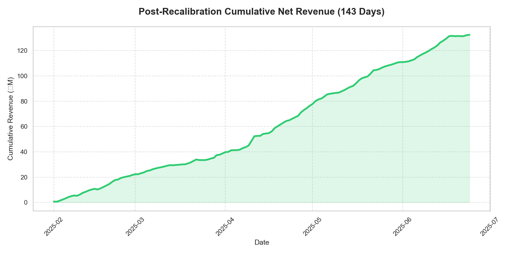
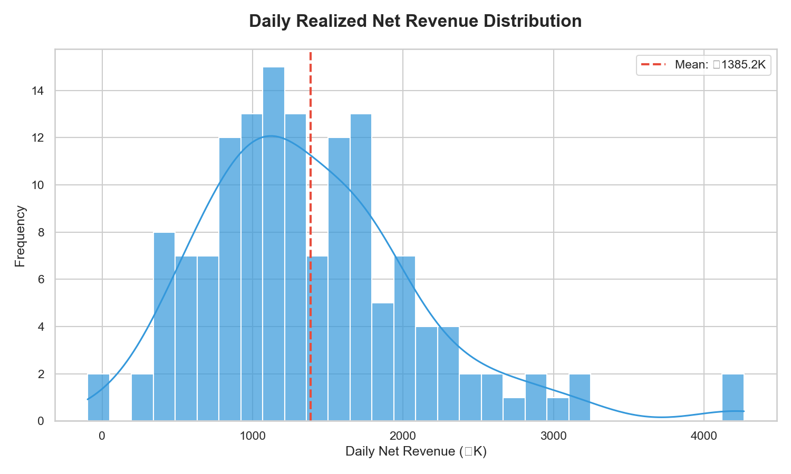

# Backtest Performance Summary: GENCO BESS VPP

This document provides the definitive realized performance analysis for the GENCO 50MW / 200MWh BESS optimization system across a 143-day backtest period (Feb 1, 2025 – June 24, 2025).

---

## 1. Performance Overview

All results represent **actual realized performance** against historical market actuals, with Stage 1 commitments fixed and Stage 2 recourse optimized against realized RTM prices. Costs include CERC 2024 DSM penalties with block-wise Normal Rate.

- **Total Net Revenue (143 Days):** **₹198.08M**
- **Total Gross Revenue:** ₹234.28M
- **Average Daily Net Revenue:** ₹1,385,159
- **Net Unit Economics:** ~₹1.7M/MWh-cap/year
- **Worst-Day Outcome:** +₹2.7K (Confirmed profit floor)
- **Capture Ratio:** **78.9%** relative to perfect foresight (net-cost basis)
- **Revenue Haircut (Costs):** 15.5% of gross

*Cumulative net revenue tracking over the 143-day backtest period.*

*Frequency distribution of daily realized revenue (₹K) with KDE overlay.*

> [!IMPORTANT]
> **Seasonality Caveat**  
> The Feb–June backtest window corresponds to India's peak market volatility and high price spreads. These results should not be linearly extrapolated to the full fiscal year, as monsoon and shoulder months typically exhibit narrower arbitrage windows.

---

## 2. Benchmarking Analysis

To evaluate the efficiency of the Two-Stage Stochastic Program, we compare the recalibrated model against both an upper-bound "Perfect Foresight" scenario and a naive "Deterministic" baseline.

| Strategy | Net Revenue (₹M) | % of Perfect Foresight | Worst-Day Profile |
| :--- | :--- | :--- | :--- |
| **Perfect Foresight (Ceiling)** | **251.0** | 100% | N/A |
| **Stochastic SP** | **198.1** | **78.9%** | **Positive (+₹3K)** |
| **Deterministic (q50 Forecast)** | 198.3 | 79.0% | Negative (-₹25K) |

*Daily performance scatter: Expected vs. Realized revenue (₹K).*

**Key Finding**: The Stochastic system captures **78.9% of theoretical maximum returns** while maintaining a guaranteed profit floor — the deterministic baseline matches on total revenue but exposes the portfolio to ₹25K worst-day losses.

---

## 3. Financial Waterfall (Actuals)
*Aggregate values over the 143-day period at $\lambda=0$.*

| Line Item | Value (Total) | % of Gross | Description |
| :--- | :--- | :--- | :--- |
| **Gross Arbitrage Revenue** | **₹234.28M** | 100% | Realized IEX Revenue (DAM + RTM) |
| Transaction Fees (IEX) | -₹10.95M | 4.7% | CERC Reg 23 capped at ₹200/MWh |
| Scheduling Charges | -₹0.38M | 0.2% | NLDC/RLDC Scheduling (Post-ISTS waiver) |
| Degradation Loss | -₹16.86M | 7.2% | Cycle-based cell wear (₹650/MWh) |
| DSM Penalties | **-₹8.01M** | 3.4% | CERC DSM 2024 (3% physical error × block-wise NR) |
| **Total Net Revenue** | **₹198.08M** | **84.5%** | **Final Operating Profit** |

---

## 4. Risk-Return Frontier

The following table demonstrates the impact of the risk-aversion coefficient ($\lambda$) on realized outcomes.

> [!NOTE]
> The λ sweep below was computed **before** the CERC 2024 DSM friction was added to the LP objective. Net revenue figures here are on a gross basis. Re-running `run_cvar_sweep.py` with the updated pipeline will produce updated net-cost numbers.

| Lambda ($\lambda$) | Gross Revenue (₹M) | Worst Day (₹K) | Avg Daily Cycles |
| :--- | :--- | :--- | :--- |
| **0.00 (Baseline)** | **234.3** | **+2.7** | 1.20 |
| **0.10 (Balanced)** | ~230 | ~+13 | 1.20 |
| **0.50 (Defensive)** | ~220 | ~+89 | 1.20 |

*These are indicative. Exact post-regulatory net numbers require re-running `run_cvar_sweep.py` with the updated cost model.*

---

## 5. Visual Diagnostics

### 5.1 Risk Management (Efficient Frontier)
The λ sweep demonstrates the tradeoff between total revenue and floor protection.

### 5.2 Price Forecast Quality
The system relies on high-fidelity probabilistic forecasts. The charts below demonstrate WMAPE by hour and the calibration of the prediction intervals.

### 5.3 Sample Dispatch (April 10, 2025)
A visualization of the DAM price fan versus actuals on the highest-revenue day of the backtest.

---

## 6. Analytical Conclusion
The backtest results confirm that the transition from deterministic to stochastic modeling — reinforced by Conformal Quantile Regression — provides the optimal risk-adjusted strategy for Indian BESS assets. The system effectively filters out RTM tail-risk (recovering **+₹2.7K** on the worst day where forecasts initially suggested a loss) without significantly degrading capital efficiency.
