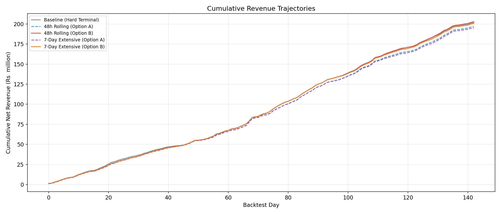

# GENCO — Concept Note

## India's AI-Native Energy Trading Platform

**Pre-Seed Round: ₹1–1.5 Crore**

---

## Executive Summary

GENCO is building India's first institutional-grade algorithmic trading and dispatch optimization platform for Distributed Energy Resources. Starting with utility-scale Battery Energy Storage Systems (BESS), we help DER asset owners extract maximum revenue from their assets on IEX by replacing rule-based dispatch ("charge at night, discharge at peak") with stochastic optimization that captures **82.8% of theoretically perfect revenue** — versus ~60-65% for naive strategies.

Our revenue model: **15% performance fee on net trading revenue + ₹50K/MW/month base platform fee**. We participate in the alpha we create, not tax the baseline. The 15% aligns with European benchmarks where optimizer revenue shares range from 15-50% depending on floor guarantees — GENCO charges at the lower end because we don't guarantee a floor, keeping the model capital-light and alignment-pure.

The long-term vision follows a clear flywheel: **optimize third-party BESS → aggregate diverse DERs including C&I behind-the-meter → build a Virtual Power Plant → own assets → sell FlexPower** — firm, schedulable capacity products to DISCOMs backed by our AI-optimized portfolio.

> **Repository**: All code, data pipelines, backtest results, and charts referenced below are in this repository. See [`BACKTEST_SUMMARY.md`](BACKTEST_SUMMARY.md) for the full 143-day performance analysis, [`ASSUMPTIONS.md`](ASSUMPTIONS.md) for all 55 disclosed modeling assumptions, and [`ARCHITECTURE.md`](ARCHITECTURE.md) for system design.

---

## The Problem

India is deploying **47 GW of BESS by 2032** — a ₹780–2,800 billion investment wave. But there's a critical gap between **hardware procurement** and **revenue realization**:

- **55 GWh** of new BESS tenders were floated in H1 2025 alone, with 38.72 GWh already awarded
- BESS capex has fallen **79% since 2022** (₹10.18/kWh → ₹2.1/kWh), making projects viable without subsidies
- Yet most operators use **basic rule-based EMS** — charge during solar hours, discharge at evening peak — leaving **30-40% of available revenue** on the table
- IEX's DAM and RTM markets have sequential clearing, cross-market spreads, and CERC DSM penalties that require **probabilistic optimization**, not spreadsheets

Beyond utility-scale BESS, India's booming **C&I open access market** (90.4% YoY growth in FY24) is creating a parallel demand for intelligent dispatch. Commercial and industrial consumers managing bilateral solar PPAs, grid backup, ToD tariffs, and behind-the-meter storage face the same optimization problem — they just don't have the tools.

**The hardware is being built. The software to monetize it doesn't exist in India.**

---

## The Solution — What We've Built

A complete ML-to-optimization pipeline, validated over **143 days of out-of-sample backtesting** on real IEX prices (Feb 1 – Jun 24, 2025).

### Core Technology Stack

| Layer | What It Does | Status |
|---|---|---|
| **Probabilistic Forecasting** | LightGBM Quantile Regression predicts DAM/RTM price distributions (q10-q90). WMAPE: DAM 15.7%, RTM 11.3% | ✅ Built & validated |
| **Scenario Generation** | Gaussian Copula with Ledoit-Wolf shrinkage produces 200 correlated DAM/RTM price paths per day | ✅ Built & validated |
| **Stochastic Optimizer** | Two-stage LP — commits DAM schedule under uncertainty, models RTM recourse. CVaR risk management | ✅ Built & validated |
| **Multi-Day Planning** | 48h rolling horizon and 7-day extensive-form variants with SoC chaining across days | ✅ Built & validated |
| **Regulatory Cost Model** | CERC 2024 DSM penalties, IEX fees, degradation — all internalized in the LP, not applied post-hoc | ✅ Built & validated |
| **Live RTM Dispatch** | Rolling intraday re-optimizer with 2h-ahead forecast for real-time RTM bidding via IEX API | 🔨 3-month build |
| **Nonlinear Degradation Model** | Rainflow cycle-counting with piecewise-linear LP embedding — smarter cycle management | 🔨 Phase 2 |
| **Fundamental Generation Model** | Proprietary solar/wind forecasts from physical irradiance + satellite data → structural price causality | 🔨 Phase 2 |

> Source: [`src/`](src/) — full Python codebase. Config: [`config/bess.yaml`](config/bess.yaml).

### Backtest Performance

**Reference asset: 50 MW / 200 MWh (180 MWh operational, 90% RTE, ₹650/MWh degradation)**

| Metric | Value |
|---|---|
| **Total Net Revenue (143 Days)** | **₹201.8M (₹20.2 Cr)** |
| **Average Daily Net Revenue** | ₹1,411K |
| **Worst Day** | **+₹55K** (no negative days) |
| **Capture Ratio vs Perfect Foresight** | **82.8%** (₹201.8M / ₹243.6M) |
| **Unit Economics** | ₹1.01M/MWh-cap over 143 days |
| **Average Daily Cycles** | 1.18 |
| **Full-Year Projection** (50% seasonal haircut) | **₹358M (₹35.8 Cr)** |

> Source: [`results/backtest_summary.json`](results/backtest_summary.json) and [`BACKTEST_SUMMARY.md`](BACKTEST_SUMMARY.md)

This is not a theoretical model. Every number is derived from a **walk-forward backtest** using only information available at D-1 08:00 IST — exactly the constraint a real IEX trader faces. All 55 disclosed assumptions and their bias directions are documented in [`ASSUMPTIONS.md`](ASSUMPTIONS.md).

### Financial Waterfall (143 Days)

| Line Item | Value | % of Gross |
|---|---|---|
| **Gross Arbitrage Revenue** | ₹239.5M | 100% |
| Transaction Fees (IEX) | −₹11.2M | 4.7% |
| Scheduling Charges | −₹0.4M | 0.2% |
| Degradation (₹650/MWh × 33,745 MWh) | −₹21.9M | 9.2% |
| CERC DSM Penalties | −₹4.2M | 1.8% |
| **Total Net Revenue** | **₹201.8M** | **84.3%** |

### Six-Strategy Comparison

We tested six optimization strategies head-to-head over the same 143 days:

| Strategy | Net Revenue (₹M) | Avg Daily (₹K) | Worst Day (₹K) | vs Baseline |
|---|---|---|---|---|
| **Soft Terminal + SoC Chaining (Production)** | **201.8** | **1,411** | **+55** | **Baseline** |
| 48h Rolling Horizon (Opt B) | 202.8 | 1,418 | −104 | +0.5% |
| 7-Day Extensive Form (Opt B) | 200.6 | 1,403 | −121 | −0.6% |
| Hard Terminal (Phase 3B) | 198.1 | 1,385 | −97 | −1.8% |
| 48h Rolling Horizon (Opt A) | 196.9 | 1,377 | −104 | −2.4% |
| 7-Day Extensive Form (Opt A) | 195.2 | 1,365 | −111 | −3.3% |
| **Perfect Foresight (Ceiling)** | **243.6** | **1,703** | **+497** | **—** |

> Source: [`results/multiday_comparison/comparison_table.csv`](results/multiday_comparison/comparison_table.csv)

**Key finding**: Single-day soft terminal optimization with SoC chaining matches or exceeds multi-day planners while maintaining a **structural worst-day floor of +₹55K** — no negative days across 143 trading days.

*Cumulative net revenue across all six strategies plus perfect foresight ceiling. Source: `results/multiday_comparison/`*

### Risk-Return Frontier (CVaR Sweep)

| λ (Risk Aversion) | Net Revenue (₹M) | Worst Day (₹K) | Sharpe |
|---|---|---|---|
| 0.00 (Baseline) | 201.8 | +55.1 | 38.4 |
| **0.10 (Optimal)** | **202.0** | **+55.1** | **39.1** |
| 0.30 | 199.7 | +55.1 | 39.0 |
| 0.50 (Defensive) | 197.1 | +52.3 | 38.8 |

> Source: [`results/cvar_sweep_summary_recalibrated.json`](results/cvar_sweep_summary_recalibrated.json)

The frontier is **remarkably flat** — worst-day floor stays at +₹55K from λ=0 to λ=0.30. **λ=0.10 achieves the highest revenue** (₹202.0M) with a 39.1 Sharpe — a free lunch from gentle CVaR regularization.

*CVaR risk-return efficient frontier. λ=0.10 is the production recommendation.*

### Forecasting Performance

| Model | WMAPE |
|---|---|
| DAM (Day D) | 15.68% |
| RTM (Day D) | 11.29% |
| DAM (Day D+1) | 19.29% |

*Hourly forecast accuracy across DAM and RTM markets.*

*Quantile calibration — CQR recalibration ensures nominal coverage matches realized coverage.*

### Dispatch Visualization

*Intra-day State-of-Charge heatmap — 143 days × 24 hours. Shows consistent daily cycling with seasonal adaptation.*

*Expected vs realized daily revenue — demonstrates consistent correlation between optimizer's ex-ante estimate and ex-post realized profit.*

---

## Why This Matters — The Revenue Uplift

A 50 MW/200 MWh BESS using naive peak-shaving dispatch earns roughly ₹22-25 Cr/year on IEX spreads. Our optimizer delivers **₹35.8 Cr/year** — a **40-60% uplift** — by:

1. **Exploiting intra-day price volatility** beyond simple peak/off-peak patterns
2. **Hedging RTM tail risk** through CVaR-constrained stochastic programming — the worst day is +₹55K, not −₹100K
3. **Multi-day SoC planning** — storing energy overnight when tomorrow's spreads are forecast wider, instead of forcing daily discharge cycles
4. **Cost-aware optimization** — IEX fees, CERC DSM penalties, and degradation are inside the LP objective, not afterthoughts

This uplift is the asset owner's money sitting on the table. We take **15% of the net trading revenue we generate** — participating in the alpha, not taxing the baseline.

---

## Business Model

### Revenue Streams

Modeled on **Habitat Energy** (UK, 2.8 GW under management) and **Tesla Autobidder** ($330M+ in trading profits for clients):

| Stream | Structure | Per 50MW Utility Asset | Per 5MW C&I Asset |
|---|---|---|---|
| **Performance Share** | 15% of net trading revenue | ~₹5.4 Cr/year | ~₹54L/year |
| **Base Platform Fee** | ₹50K/MW/month | ₹3.0 Cr/year | ₹30L/year |
| **Total per asset** | | **₹8.4 Cr/year** | **₹84L/year** |

Our 85:15 split (85% to asset owner, 15% to GENCO) is at the **lower end of European benchmarks** where optimizer revenue shares range from 15-50% depending on floor guarantees. GENCO's no-floor model keeps us capital-light and incentive-aligned.

### Scaling Path

| Year | Utility Assets | C&I Assets | Total MW | GENCO Revenue |
|---|---|---|---|---|
| **Y1** | 2 pilot BESS | — | 100 MW | ₹16.8 Cr |
| **Y2** | 5 BESS | 5 C&I pilots | 275 MW | ₹46.1 Cr |
| **Y3** | 10 BESS (VPP threshold) | 20 C&I | 600 MW | ₹100.6 Cr |

### The Flywheel: Optimization → DER Platform → VPP → Asset Ownership

**Phase 1 (Y1-Y2): Optimization-as-a-Service — Utility BESS**
- Sign 2-3 pilot BESS assets (Juniper Green, NTPC, Adani candidates)
- Prove live performance matches backtest capture ratio
- Revenue share alignment eliminates customer acquisition friction — customers pay only for value created

**Phase 2 (Y2-Y3): Virtual Power Plant + DER Expansion**
- Aggregate 500+ MW of diverse DER under unified dispatch
- Extend optimization beyond standalone BESS to **co-located solar+storage, C&I behind-the-meter systems, and EV charging depots** — each DER type feeds the same LP core with asset-specific constraints
- Portfolio diversification reduces revenue volatility — solar generation forecast errors are uncorrelated with BESS price forecast errors
- CERC's new VPPA guidelines (notified December 2025) explicitly enable aggregated virtual power purchase agreements
- CERC's IESS framework (December 2025) permits storage participation in ancillary services, congestion relief, and merchant discharge

**Phase 3 (Y3+): Asset Ownership + FlexPower**
- Use trading track record to secure project finance for GENCO-owned BESS assets — BESS capex at ₹1.7-1.85 lakh/MW/month discovered tariff makes merchant projects viable
- Launch **FlexPower** — firm capacity products sold to DISCOMs, backed by the aggregated VPP fleet
- FlexPower transforms volatile DER output into **bankable, schedulable supply** — the product India's distribution utilities will pay a premium for as RE penetration crosses 30%
- Revenue shifts from pure optimization fees to **spread between FlexPower contract price and marginal dispatch cost** of the aggregated fleet
- Owned assets + third-party fleet = diversified portfolio with both trading alpha and asset returns

---

## Market Opportunity

### India's BESS Deployment Trajectory

| Year | Cumulative Deployed |
|---|---|
| 2025 | 758 MWh (commissioned) |
| 2026 | ~5 GWh (pipeline) |
| 2028 | ~30 GWh (awarded tenders) |
| 2032 | 74 GW / 411 GWh (CEA target) |

### Utility-Scale BESS Optimization

Every GWh of merchant/quasi-merchant BESS needs dispatch optimization. At our revenue share structure:

- **2028 TAM** (30 GWh deployed): **~₹800 Cr** addressable by optimization platforms
- **2032 TAM** (74 GWh target): **~₹2,000 Cr**

There is **no Indian incumbent** in algorithmic BESS trading. Internationally, Fluence claims 40-50% revenue improvement from AI optimization. Tesla's Autobidder manages 7 GWh globally. Neither has localized for IEX's unique DAM/RTM structure, CERC DSM penalties, or Indian grid dynamics.

### C&I Behind-the-Meter

India's C&I BESS segment is projected to capture **15-18% of 40+ GWh** deployed by 2030 — 6-7 GWh of C&I storage. The optimization problem is identical in structure to utility-scale arbitrage:

- **ToD tariff arbitrage**: C&I consumers on Time-of-Day tariffs pay 20-30% more during peak hours. BESS + optimizer shifts consumption to flatten demand charges
- **Open access optimization**: The C&I open access market grew 90.4% YoY in FY24. These consumers manage bilateral solar PPAs + grid backup + BESS — a miniature version of our DAM/RTM optimizer
- **DSM penalty avoidance**: C&I consumers on open access face the same CERC DSM penalties our cost model already handles (see [`ASSUMPTIONS.md`](ASSUMPTIONS.md))

**C&I TAM**: ₹100-150 Cr annual optimization revenue by 2030. GENCO's optimizer ports directly — replace DAM/RTM price feeds with ToD tariff schedules + open access bilateral prices, same LP core, same CVaR framework.

### Full DER Aggregation

The India DERMS market is projected to grow from **$2.96B (2025) to $9.14B (2031)** at 20.7% CAGR. GENCO's platform architecture is DER-agnostic by design:

| Phase | DER Types | What GENCO Does |
|---|---|---|
| Phase 1 | Utility-scale BESS | IEX arbitrage optimization |
| Phase 2 | BESS + solar/wind co-located | Curtailment avoidance + storage dispatch |
| Phase 3 | C&I BTM BESS + rooftop solar | ToD optimization + demand charge management |
| Phase 4 | Full VPP (BESS + RE + EV chargers + flexible loads) | Aggregated dispatch, FlexPower products to DISCOMs |

**Total Addressable Market across all segments:**
- Utility-scale BESS optimization: ₹800-2,000 Cr (2028-2032)
- C&I dispatch optimization: ₹100-150 Cr (by 2030)
- Full DERMS platform: $2.96-9.14B / ₹2,500-7,700 Cr (2025-2031)

---

## Technical Roadmap

### Phase 1 (Pre-Seed, Months 1-16): Live Trading

| Milestone | Timeline | Deliverable |
|---|---|---|
| Live RTM dispatch module | Months 1-3 | Rolling 2h-ahead forecaster + intraday re-optimizer; shadow trading on real IEX data |
| First pilot asset signed | Months 4-6 | 50 MW BESS under GENCO dispatch |
| Live trading revenue | Months 7-9 | First ₹ from IEX — validate backtest capture ratio |
| Second asset onboarded | Months 10-12 | Portfolio effects demonstrated |
| Seed-ready metrics | Months 13-16 | Live capture ratio, revenue attribution, customer retention |

### Phase 2 (Post-Seed): Advanced Models + Market Expansion

**Nonlinear Degradation Model**

Current system uses a flat ₹650/MWh throughput cost on discharge (see [`config/bess.yaml`](config/bess.yaml)). This over-penalizes shallow cycles and under-penalizes deep cycles. Real LFP degradation is nonlinear — a 20% DoD cycle costs roughly 1/4th of a full 80% DoD cycle in actual cell life.

Phase 2 builds **Rainflow cycle-counting** with piecewise-linear approximation embedded directly in the LP. The nonlinear degradation curve is approximated with 3-5 linear segments, preserving the LP structure without switching to nonlinear solvers. This enables the optimizer to **choose shallow cycles when spreads are narrow** and deep cycles only when spreads justify the accelerated wear.

- **Estimated impact**: 3-8% net revenue uplift from smarter cycle management
- **Strategic value**: Required for bankable multi-year revenue projections demanded by project finance lenders — the gating requirement for Phase 3 asset ownership

**Fundamental Generation Model**

Current system ingests POSOCO grid data (demand, solar, wind, thermal mix) as observed input features. The optimizer doesn't have its own generation forecast — it treats supply-side variables as statistical inputs, not predicted fundamentals. Phase 2 builds proprietary forecasts:

- **Solar generation forecast**: Physical + statistical model using GFS/ERA5 irradiance, satellite cloud cover, installed capacity by state. Solar is now the single most important DAM price driver (India generated 17 TWh in H1 2025, +25% YoY)
- **Wind generation forecast**: Similar structure using NWP wind speed forecasts
- **Net demand forecast**: Demand minus RE generation — this is what sets the marginal clearing price on IEX

This creates a **structural supply-demand model** where price predictions emerge from fundamentals rather than purely statistical patterns:

1. **Improved accuracy**: DAM WMAPE target below 12% (from current 15.7%)
2. **Extended horizon**: D+2 through D+6 forecasts with physics-based confidence rather than climatological fallback
3. **Second product line**: Generation forecasts sold independently to RE developers for scheduling compliance — a standalone revenue stream

### Phase 3 (Y3+): C&I Module + FlexPower Product Development

- Port optimizer to C&I tariff structures (ToD schedules, demand charges, open access bilateral prices)
- Build FlexPower product layer — aggregated VPP capacity sold as firm supply to DISCOMs
- Asset acquisition underwriting using live trading track record

---

## Regulatory Tailwinds

The regulatory environment is uniquely favorable right now:

- **CERC VPPA Guidelines (Dec 2025)**: Formally enables virtual power purchase agreements — the financial backbone of VPP aggregation
- **CERC IESS Framework (Dec 2025)**: Integrates storage into tariff code, permits multi-market participation (arbitrage + ancillary + congestion)
- **ISTS Waiver**: 100% waiver of inter-state transmission charges for BESS co-located with RE, extended to June 2028
- **VGF Tranche 2**: ₹5,400 Cr for 30 GWh of standalone BESS
- **State-level mandates**: Rajasthan requires 5% ESS for RE projects >5 MW; Bihar targets 6.1 GWh by 2030
- **IEX API-based RTM bidding**: Already live for 10+ members

India's BESS market is moving from "tenders" to "commissioning" in 2026. The optimization layer needs to be ready when the hardware goes live.

---

## Competitive Landscape

| Player | Geography | Approach | India Presence |
|---|---|---|---|
| **Tesla Autobidder** | US, Australia | Hardware-locked (Megapack only) | None — no IEX integration |
| **Fluence** | US, Europe | Full-stack (hardware + software) | Hardware sales only, no trading |
| **Habitat Energy** | UK, Australia, US | Pure optimization, revenue share | None — no India operations |
| **Indian EMS vendors** | India | Rule-based SCADA dispatch | No ML, no stochastic optimization |
| **GENCO** | **India** | **IEX-native stochastic optimizer + DER platform** | **✅ Built for IEX DAM/RTM + CERC regs** |

Our moat is **IEX-specific domain expertise**: the copula-based scenario generation calibrated to Indian price dynamics, CERC 2024 DSM penalty modeling, and the feature engineering pipeline that ingests Indian grid fundamentals (POSOCO demand, monsoon seasonality, CDH-based cooling load). This isn't transferable from a European or American platform without significant rebuilding. The Phase 2 fundamental generation model deepens this moat — proprietary solar/wind forecasts calibrated to India's specific RE fleet become a compounding data advantage.

---

## Team & Ask

### Pre-Seed: ₹1–1.5 Crore

| Use of Funds | Allocation |
|---|---|
| Live RTM module + IEX API integration | 35% |
| Cloud infrastructure + data pipeline | 20% |
| Pilot asset onboarding (2 assets) | 25% |
| Team (CTO hire + quantitative developer) | 20% |

**Monthly burn**: ~₹8L → **16-month runway** at ₹1.25 Cr.

### What We're Looking For

Beyond capital: **introductions to BESS asset owners** (Juniper Green, NTPC, Adani Green, Greenko, Avaada) who have commissioned or are commissioning storage assets and need trading infrastructure. The first two pilots prove the economics; everything after that sells itself.

For C&I market entry: introductions to **large open access consumers and C&I solar+storage developers** who need dispatch optimization for behind-the-meter assets.

---

## Risk Factors & Mitigations

| Risk | Mitigation |
|---|---|
| **Revenue cannibalization** (more BESS → flatter IEX spreads) | Multiple defenses: (a) ancillary services revenue stacking — accounts for 50-80% of full storage revenue in mature markets; (b) FlexPower products create contracted revenue independent of spread levels; (c) fundamental generation model identifies structural spread drivers; (d) C&I market has different price dynamics uncorrelated with IEX spread compression |
| **IEX spread compression** | Diversify into ancillary services (CERC regulations enable BESS participation); VPP aggregation creates new revenue streams |
| **Regulatory change** (ISTS waiver expiry, DSM rule changes) | Cost model is parameterized and config-driven — rule changes update a YAML file, not the optimizer (see [`config/`](config/)) |
| **Live performance < backtest** | RTM evaluation assumption is conservatively bounded; 5-10% haircut built into projections. Shadow trading validates before capital deployment |
| **Customer concentration** | Revenue share model aligns incentives — customers only pay for value created. C&I expansion diversifies customer base across industries |
| **Technology risk** (ML model drift) | Walk-forward retraining already built into pipeline; CQR recalibration corrects for distribution shift. Phase 2 fundamental model adds structural resilience |

---

## The Core Thesis

India is building **$10B+ of battery storage infrastructure** over the next 5 years. Behind it, a **$9B DERMS market** is forming as millions of distributed assets — rooftop solar, C&I batteries, EV chargers — need intelligent orchestration. The atoms are being deployed. What's missing is the **intelligence layer** that turns stored electrons into optimized revenue.

GENCO is that layer. The optimizer works — **82.8% capture ratio, +₹55K worst day, ₹201.8M net over 143 days** ([full results](BACKTEST_SUMMARY.md)). The math is validated. The market is arriving. We need ₹1-1.5 Cr and 12 months to go from backtest to live trading — and from there, to India's first AI-native Virtual Power Plant.

**From BESS arbitrage → C&I dispatch → DER aggregation → FlexPower products → asset ownership.** The technical foundation is DER-agnostic by construction. The regulatory tailwinds are blowing. The hardware deployment wave is cresting. Now is the time to capture the market.

---

*GENCO — Channeling capital toward energy solutions balancing returns with planetary boundaries.*
