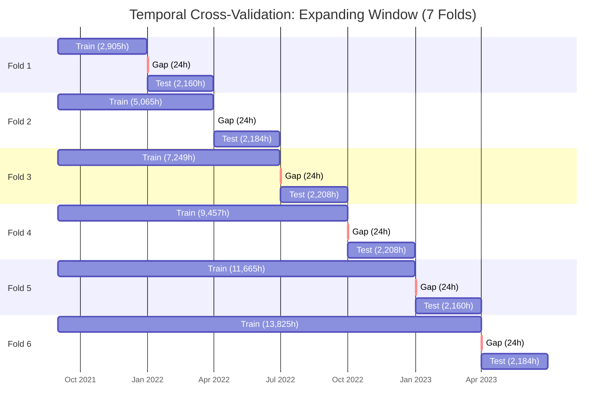
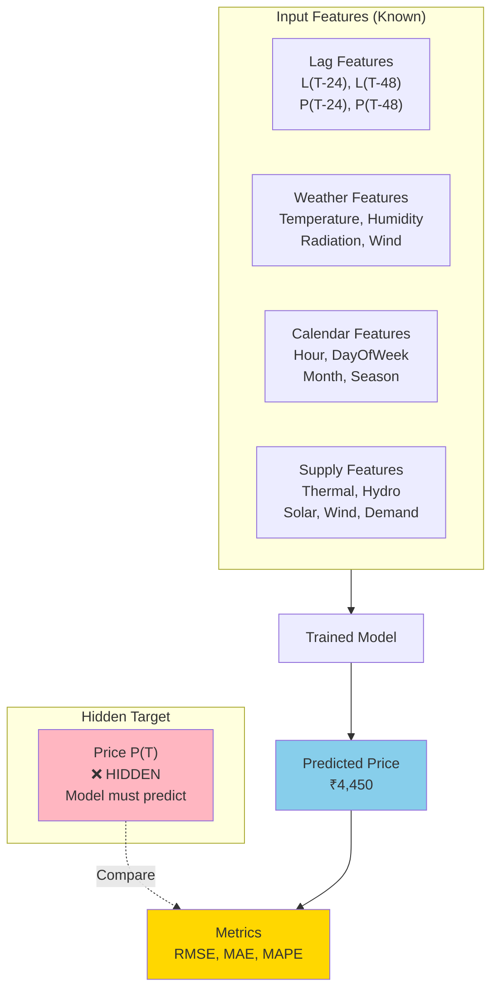
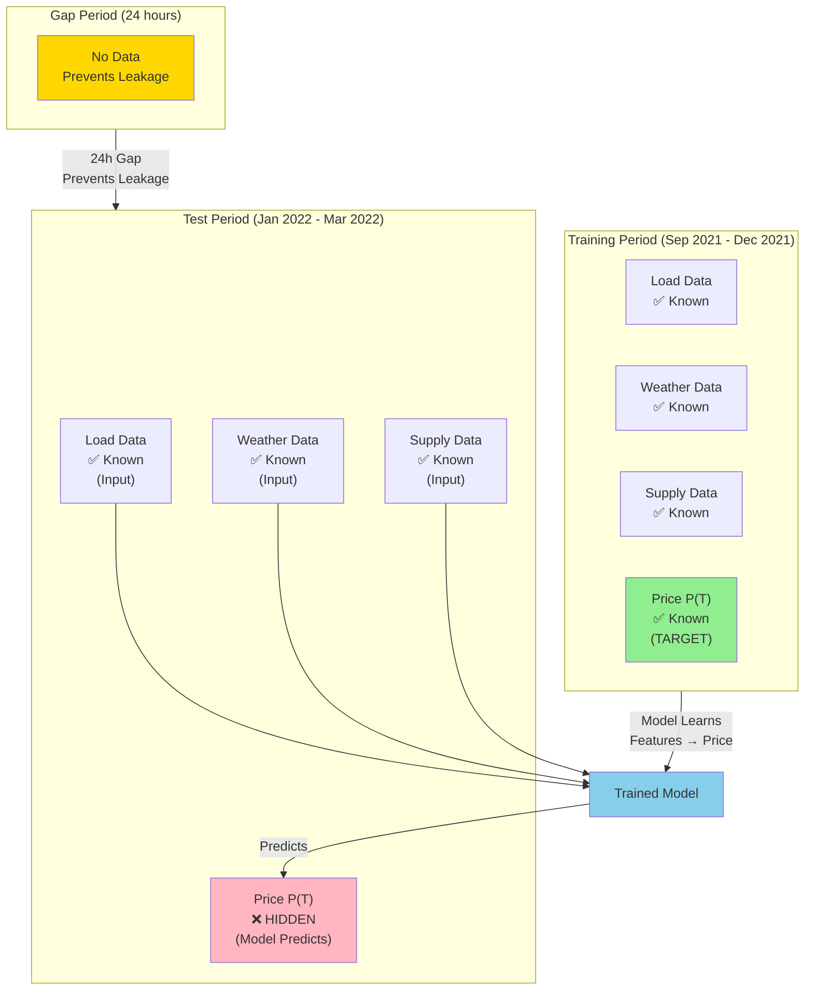
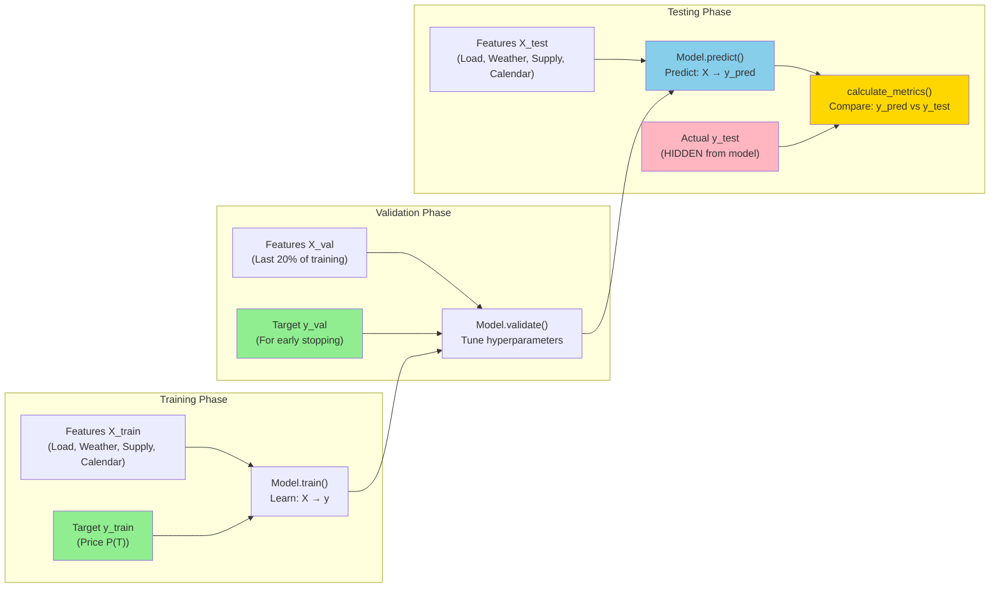

# Temporal Cross-Validation: How Training & Testing Works

## Overview

This document explains how temporal cross-validation works in the IEX electricity price forecasting model. **All date ranges, fold counts, and example numbers in this doc are illustrative** — they describe the methodology and typical configuration, not actual data or run outputs. The model **deliberately hides data from itself** during training to prove it can predict the unknown future.

## The Core Concept: Simulating Future Predictions

Even though we have historical data from September 2021 to June 2025, we **simulate** being at an earlier point in time:

```
FULL DATASET: Sep 2021 ════════════════════════════════════════════════════► Jun 2025
              ├───────────────────────────────────────────────────────────────┤
              
WHAT MODEL SEES DURING TRAINING (Fold 1):
              
Training:     Sep 2021 ═══════════════► Dec 2021
              ├──────────────────────────┤
              "Learn patterns from this"
              
Testing:      ████████████████████████████ Jan 2022 ══► Mar 2022
              (Model CANNOT see this)     ├────────────┤
                                          "Predict this blind"
```

During testing, the model:
- ✅ Gets: Load, Weather, Calendar features for Jan–Mar 2022
- ❌ Does NOT get: Price P(T) for Jan–Mar 2022
- 🎯 Must predict: Price P(T) for Jan–Mar 2022
- ✅ Then we compare: Predicted vs Actual (which we secretly have)

---

## Actual Temporal Cross-Validation Setup

### Configuration Parameters

From [`../config/model_config.yaml`](../config/model_config.yaml):

```yaml
cv:
  n_splits: 7          # Requested folds (expanding window)
  gap_hours: 24        # 24-hour gap between train and test
  test_months: 3       # 3-month test periods
```

**Key Points:**
- **6 folds actually created** (dataset ends Aug 29, 2023, so 7th fold would extend beyond data)
- **24-hour gap** (not 48) - prevents data leakage from `P(T-24)` lag feature
- **3-month test periods** - balances statistical significance with temporal diversity

### Why 24-Hour Gap?

The model uses `P(T-24)` as a feature (price from 24 hours ago). Without a gap:
- Test hour Jan 1, 12 AM would use `P(T-24)` = Dec 31, 12 AM
- Dec 31 was in the training set
- This creates **data leakage**—the model indirectly "sees" training data during testing

The 24-hour gap ensures the test is truly blind.

---

## Actual Fold Structure

The CV uses an **expanding window** approach—each fold adds more training data:

### Visual Timeline of All Folds



```
FOLD 1:
═══════════════════════════════════════════════════════════════════════
Train: Sep 2021 ────────────────────────► Dec 2021    (2,905 hours)
                                          ║
                                    [24-hour gap]
                                          ║
Test:                                     ║ Jan 2022 ──► Mar 2022 (2,160 hours)


FOLD 2:
═══════════════════════════════════════════════════════════════════════
Train: Sep 2021 ────────────────────────────────────► Mar 2022  (5,065 hours)
                                                      ║
                                                [24-hour gap]
                                                      ║
Test:                                                 ║ Apr 2022 ──► Jun 2022 (2,184 hours)


FOLD 3:
═══════════════════════════════════════════════════════════════════════
Train: Sep 2021 ────────────────────────────────────────────► Jun 2022 (7,249 hours)
                                                              ║
                                                        [24-hour gap]
                                                              ║
Test:                                                         ║ Jul 2022 ──► Sep 2022 (2,208 hours)


FOLD 4:
═══════════════════════════════════════════════════════════════════════
Train: Sep 2021 ────────────────────────────────────────────────────► Sep 2022 (9,457 hours)
                                                                      ║
                                                                [24-hour gap]
                                                                      ║
Test:                                                                  ║ Oct 2022 ──► Dec 2022 (2,208 hours)


FOLD 5:
═══════════════════════════════════════════════════════════════════════
Train: Sep 2021 ────────────────────────────────────────────────────────────► Dec 2022 (11,665 hours)
                                                                              ║
                                                                        [24-hour gap]
                                                                              ║
Test:                                                                          ║ Jan 2023 ──► Mar 2023 (2,160 hours)


FOLD 6:
═══════════════════════════════════════════════════════════════════════
Train: Sep 2021 ────────────────────────────────────────────────────────────────────► Mar 2023 (13,825 hours)
                                                                                      ║
                                                                                [24-hour gap]
                                                                                      ║
Test:                                                                                  ║ Apr 2023 ──► Jun 2023 (2,184 hours)


```

### Actual Fold Details

| Fold | Train Period | Train Hours | Test Period | Test Hours | Gap |
|------|-------------|-------------|-------------|------------|-----|
| 1 | Sep 2021 - Dec 2021 | 2,905 | Jan 2022 - Mar 2022 | 2,160 | 24h |
| 2 | Sep 2021 - Mar 2022 | 5,065 | Apr 2022 - Jun 2022 | 2,184 | 24h |
| 3 | Sep 2021 - Jun 2022 | 7,249 | Jul 2022 - Sep 2022 | 2,208 | 24h |
| 4 | Sep 2021 - Sep 2022 | 9,457 | Oct 2022 - Dec 2022 | 2,208 | 24h |
| 5 | Sep 2021 - Dec 2022 | 11,665 | Jan 2023 - Mar 2023 | 2,160 | 24h |
| 6 | Sep 2021 - Mar 2023 | 13,825 | Apr 2023 - Jun 2023 | 2,184 | 24h |

**Note:** The dataset now covers September 2021 to June 2025. The CV configuration can be adjusted to use the full period for training and testing.

**Note:** First test starts after **4 months** of training (January 2022), not 10 months.

---

## What Happens in Each Test Fold (Detailed Example)

Let's walk through **one test hour** in Fold 1, predicting **January 15, 2022, 6:00 PM**:

### Step 1: Model Receives These Features (Known)



| Feature | Value | Source | Status |
|---------|-------|--------|--------|
| `L(T-24)` | 158,000 MW | Actual load from Jan 14, 6 PM | ✅ Known |
| `L(T-48)` | 155,000 MW | Actual load from Jan 13, 6 PM | ✅ Known |
| `P(T-24)` | ₹4,200 | Actual price from Jan 14, 6 PM | ✅ Known |
| `P(T-48)` | ₹3,800 | Actual price from Jan 13, 6 PM | ✅ Known |
| `Temperature` | 34°C | Actual weather Jan 15 | ✅ Known |
| `Hour` | 18 | Calendar feature | ✅ Known |
| `Solar` | 12,000 MW | Actual from NERLDC | ✅ Known |
| `P(T)` | **??? HIDDEN** | Model must predict | ❌ Hidden |

### Step 2: Model Makes Prediction

```python
# From v2/train_lstm.py and point-forecast pipeline
X_test = df[features].loc[test_indices]  # Features only, no P(T)
y_test = df['P(T)'].loc[test_indices]    # Actual prices (hidden from model)

y_pred = model.predict(X_test)  # Model predicts: ₹4,450
```

### Step 3: Compare to Hidden Actual

```python
# From src/validation/metrics.py
actual_price = 4,320  # We secretly have this in dataset_cleaned.parquet

error = abs(4450 - 4320)  # = ₹130
percentage_error = 130 / 4320 * 100  # = 3.0% APE
```

### Step 4: Repeat for All Test Hours

| Test Hour | Predicted | Actual | APE |
|-----------|-----------|--------|-----|
| Jan 15, 6 PM | ₹4,450 | ₹4,320 | 3.0% |
| Jan 15, 7 PM | ₹5,200 | ₹5,850 | 11.1% |
| Jan 15, 8 PM | ₹4,900 | ₹4,750 | 3.2% |
| ... | ... | ... | ... |
| Mar 31, 11 PM | ₹2,100 | ₹2,050 | 2.4% |

**Final Test MAPE = Average of all APEs** (typically 8-15% for electricity prices)

---

## Training Process Details

### Data Splitting

From [`../v2/train_lstm.py`](../v2/train_lstm.py) and CV logic in [`../src/validation/temporal_cv.py`](../src/validation/temporal_cv.py):

```python
for fold_idx, (train_indices, test_indices) in enumerate(cv):
    # Split data
    X_train = X.loc[train_indices]  # Features for training period
    y_train = y.loc[train_indices]  # Target P(T) for training period
    X_test = X.loc[test_indices]    # Features for test period
    y_test = y.loc[test_indices]    # Actual P(T) for test period (hidden)
    
    # Create validation set (last 20% of training data)
    val_size = int(len(X_train) * 0.2)
    X_train_fit = X_train.iloc[:-val_size]
    y_train_fit = y_train.iloc[:-val_size]
    X_val = X_train.iloc[-val_size:]
    y_val = y_train.iloc[-val_size:]
    
    # Train model
    model.train(X_train_fit, y_train_fit, X_val, y_val)
    
    # Make predictions on test set
    y_pred = model.predict(X_test)  # Model doesn't see y_test!
    
    # Calculate metrics
    metrics = calculate_metrics(y_test.values, y_pred)
```

**Key Points:**
- **Training set**: Used to learn model parameters
- **Validation set**: Last 20% of training data, used for early stopping
- **Test set**: Model never sees `y_test` during training or prediction
- **Metrics**: Compare `y_pred` (model's guess) vs `y_test` (actual)

---

## Visual: What the Model Knows vs. Doesn't Know

### Data Availability Diagram



### Data Flow During Training and Testing



---

## Example CV Results (Illustrative Only)

After running temporal CV, results are written to `results/training/` (e.g. `enhanced_cv_results.csv`). The table below is **illustrative only** — real metrics depend on your data and model.

| Fold | Train Hours | Test Hours | RMSE (example) | MAPE (example) | R² (example) |
|------|-------------|------------|----------------|----------------|--------------|
| 1 | ~2,900 | ~2,160 | — | e.g. 12–16% | e.g. 0.75–0.85 |
| 2 | ~5,000 | ~2,180 | — | e.g. 12–16% | e.g. 0.80–0.88 |
| … | … | … | … | … | … |
| 6 | ~14,000 | ~2,180 | — | e.g. 9–12% | e.g. 0.88–0.92 |

**What to look for (on your own runs):**
- MAPE often improves as training data grows (more history → better fit)
- R² often increases across folds
- Directional accuracy typically in a reasonable range (e.g. 60–90% depending on period)
- No single fold with dramatically worse performance (could indicate overfitting or data issues)

---

## How to Verify Your Model is Working

### 1. Check CV Results Files

```bash
cat results/training/enhanced_cv_results.csv
```

**Healthy signs:**
- MAPE decreasing as training data grows (model improves with more data)
- MAPE between 7-15% is reasonable for electricity prices
- No fold with dramatically worse performance (would indicate overfitting)

### 2. Check Predictions vs Actuals

```python
import pandas as pd

# Load predictions (path relative to project root)
df = pd.read_parquet('results/training/enhanced_predictions.parquet')
print(df[['timestamp', 'y_true', 'y_pred']].head(20))
```

### 3. Check Residual Diagnostics

Diagnostic plots are saved in `results/training/diagnostics/`. Look for:

| Plot | What to Check | Bad Sign |
|------|---------------|----------|
| Residuals vs Time | Should be random scatter | Trend = model misses time patterns |
| Residuals vs Hour | Should be flat | Spikes at 6-8 PM = model misses evening peaks |
| Residuals vs Actual | Should be homoscedastic | Funnel shape = errors grow with price |
| ACF of Residuals | No significant autocorrelation | Lag-1 spike = model misses short-term dynamics |

---

## Summary: The Testing Logic

| Phase | Price P(T) | Other Features | What Happens |
|-------|------------|----------------|--------------|
| **Training** | ✅ Provided | ✅ Provided | Model learns relationship: Features → Price |
| **Validation** | ✅ Provided | ✅ Provided | Model tunes hyperparameters, early stopping |
| **Testing** | ❌ Hidden | ✅ Provided | Model predicts price; we compare to hidden actual |
| **Inference** | ❌ Unknown (future) | ⚠️ Some forecasted | Model predicts; no actual exists yet to compare |

**Key Insight:** Testing simulates inference conditions using historical data where you secretly know the answer. If the model performs well on testing, you have evidence it will perform similarly on true future predictions.

---

## Code References

### Key Files

1. **CV Split Logic**: [`../src/validation/temporal_cv.py`](../src/validation/temporal_cv.py)
   - `temporal_cv_split()` function: Creates train/test splits
   - `TemporalCV` class: Iterator over CV folds

2. **Training Loop**: [`../v2/train_lstm.py`](../v2/train_lstm.py) and related scripts in `v2/`
   - Iterates over folds, trains model, makes predictions
   - Creates validation set from training data
   - Calculates metrics comparing predictions to actuals

3. **Metrics Calculation**: [`../src/validation/metrics.py`](../src/validation/metrics.py)
   - `calculate_metrics()`: Computes RMSE, MAE, MAPE, R², Directional Accuracy

4. **Configuration**: [`../config/model_config.yaml`](../config/model_config.yaml)
   - CV parameters (`n_splits`, `gap_hours`, `test_months`)

---

## Frequently Asked Questions

### Q: Why not use random train/test split?

**A:** Electricity prices have strong temporal patterns (daily, weekly, seasonal cycles). Random splits would leak future information into training, giving unrealistically optimistic results. Temporal CV respects the time ordering.

### Q: Why 24-hour gap instead of 48-hour?

**A:** The model uses `P(T-24)` as a feature. A 24-hour gap is sufficient to prevent leakage. A 48-hour gap would be more conservative but wastes data.

### Q: Why 6 folds instead of 5?

**A:** More folds provide:
- Better statistical robustness (more test periods)
- More diverse validation (different seasons, market conditions)
- Better understanding of model performance over time

**Note:** The config requests 7 folds, but only 6 are created because the dataset ends on August 29, 2023, which doesn't allow for a complete 7th test period through September 2023.

### Q: What if MAPE increases in later folds?

**A:** This could indicate:
- Concept drift (market conditions changed)
- Overfitting (model memorized training patterns)
- Data quality issues in later periods

Check residual diagnostics and compare feature distributions across folds.

### Q: How do I know if my model is good enough?

**A:** Check these criteria:
- ✅ MAPE < 15% (electricity prices are volatile)
- ✅ R² > 0.80 (model explains most variance)
- ✅ Directional Accuracy > 60% (model captures price direction)
- ✅ Residuals are random (no patterns in errors)
- ✅ Performance improves with more training data

---

## Related Documentation

- [README.md](../README.md) - Project overview and usage
- [ARCHITECTURE.md](../ARCHITECTURE.md) - Detailed technical architecture
